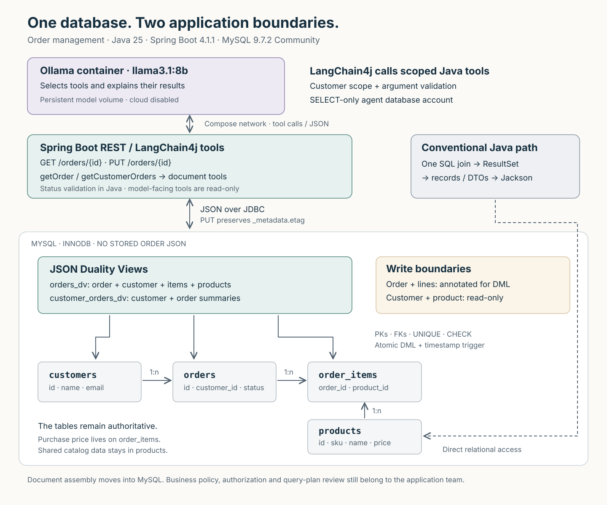

# Order Duality

A small Java order-management application investigating **MySQL JSON Duality Views** over an existing relational model. The interesting part is what happens when a client writes the document back.

The project uses Java 25, Spring Boot 4.1.1, plain JDBC and MySQL **9.7.2 Community Server**. LangChain4j 1.20.0 connects the read-only agent tools to local Ollama. Customers, orders, order items and products remain ordinary normalized tables. There are **no JSON columns in the application schema**. A temporary JSON-column experiment is kept separate.

Read the [article](docs/article.md), the [lab notes](docs/lab-notes.md), or the [captured experiment results](docs/evidence/experiments.txt). The [ACE submission description](docs/ace-submission.md) maps the work to the bounty criteria.



## What is actually demonstrated

- A writable order document with a customer object, multiple order lines and nested product objects.
- A working `GET /orders/{id}` and deliberately restricted `PUT /orders/{id}` for status changes.
- Document INSERT, UPDATE and DELETE tested directly against MySQL, including adding/removing lines and relational readback.
- An equally real one-query JDBC/record/Jackson baseline.
- A real local Ollama agent that chooses read-only tools and answers from MySQL documents. The deterministic mock is also available for offline comparison.
- Validation, foreign keys, rollback, stale tokens, simultaneous writers, unsupported view definitions and statement forms.

The latest native and complete Compose runs each passed **22 unit tests and 33 integration tests** on Temurin 25.0.1, with none skipped ([native summary](docs/evidence/test-summary.txt), [Compose summary](docs/evidence/compose/test-summary.txt)). Earlier Compose runs are kept in [compose-2026-09-22](docs/evidence/compose-2026-09-22/test-summary.txt) and [compose-2026-09-23-before-sorting](docs/evidence/compose-2026-09-23-before-sorting/test-summary.txt). This is a functional demonstration, not a throughput benchmark or a production commerce service.

The integration total includes three real Ollama cases. The [native answer review](docs/evidence/ollama-answer-review.md) and [Compose answer review](docs/evidence/compose/answer-review.md) inspect the actual prose. Before the customer-orders tool sorted orders in Java, the history answer's correctness depended on the unspecified order of the view's array: the [September 22 Compose run](docs/evidence/compose-2026-09-22/answer-review.md) called a shipped order open, and the [next run](docs/evidence/compose-2026-09-23-before-sorting/answer-review.md), with a different array order, did not. With sorted input the fixture answers are correct, but a CLI run still misordered two orders it received sorted. Passing protocol and selected-value checks is not proof of a correct model explanation.

## Requirements and exact versions

For the complete Compose setup, install Docker Desktop (or Docker Engine with Compose). Java, Maven and Ollama run in containers. Host Java 25/Maven and native Ollama are only needed for the optional development workflow. The first run downloads container images, Maven dependencies and roughly 4.9 GB of model weights.

| Component | Version used |
|---|---|
| Java | 25; native development used Temurin 25.0.1; the container runtime uses Temurin 25.0.4 |
| Maven | 3.9.11 in the build container; 3.9.4 for the native investigation |
| Spring Boot | 4.1.1, Spring MVC with embedded Tomcat |
| LangChain4j | 1.20.0, including the Ollama integration |
| MySQL | 9.7.2, `MySQL Community Server - GPL` |
| Connector/J | 9.7.0 |
| Jackson | 3.1.5 (Boot-managed) for the application's JSON; LangChain4j uses its own Boot-managed Jackson 2 internally |
| HikariCP | 7.0.2 (Boot-managed), one pool per database account |
| JUnit Jupiter | 6.0.3 |
| Docker | Docker Engine with Compose supporting `up --wait` |
| Ollama | 0.32.9, official container image; the earlier investigation also used native macOS ARM64 |
| Local model | `llama3.1:8b`, 8.0B parameters, Q4_K_M; about 4.9 GB on disk |

The MySQL image is pinned by version **and digest**:

```text
mysql:9.7.2@sha256:30a0abfa7b502a496e12339b54cd07aaa70363396dc4b8e8a72a92804a505cd6
```

The Ollama, Maven and Java runtime images are also digest-pinned in Compose and the [Dockerfile](Dockerfile). Local testing uses ARM64; AMD64 is available in the image manifests but was not tested here. `curl` and Python 3 are needed for the optional smoke script; `jq` is convenient for the examples below.

**HeatWave is not required.** MySQL's [9.7.0 release notes](https://dev.mysql.com/doc/relnotes/mysql/9.7/en/news-9-7-0.html) announce Community support for document DML. Earlier version/edition restrictions should not be applied to this tested release. MySQL 8.4 is not a substitute for the pinned server.

## Java 25 idioms

The application lives in `com.bazlur.orders`, with Maven coordinates `com.bazlur:order-duality`. The build uses finalized Java 25 features and needs no `--enable-preview` flags:

- Module imports such as `import module java.sql;` make JDBC examples readable. This is a classpath Maven application; a `module-info.java` is not required.
- CLI and startup output go through SLF4J logging. Unused callback and exception bindings use `_`; JSON validation uses `instanceof` patterns.
- The conventional DTOs and configuration properties are records. `Order` defensively copies its items in its compact constructor; `DatabaseProperties` overrides the generated `toString` so passwords never reach logs.
- `OrderStatus` and `OrderException.Kind` are enums used in exhaustive `switch` expressions: adding a status or error kind does not compile until every mapping handles it. The API maps each kind to an RFC 9457 `ProblemDetail`.
- SQL uses text blocks and JDBC uses try-with-resources. Spring Boot enables virtual threads with `spring.threads.virtual.enabled=true`.
- [OrdersApplication](src/main/java/com/bazlur/orders/OrdersApplication.java) uses the conventional static Spring Boot entry point. Java 25 idioms belong where they improve the code; the bootstrap does not need to demonstrate every language feature.

Module imports are the Java 25 addition here; the other idioms were finalized earlier. See the official [module import documentation](https://docs.oracle.com/en/java/javase/25/language/module-import-declarations.html). Spring Boot's [system requirements](https://docs.spring.io/spring-boot/system-requirements.html) include Java 25.

## Run everything with Docker Compose

From the repository root:

```bash
docker compose up --build -d --wait
```

This builds the Java application, starts MySQL and Ollama, and runs `ollama-init` to download `llama3.1:8b` if it is missing. The app waits for MySQL health and successful model initialization. An installed model is reused on later starts; the init step does not refresh a mutable model tag automatically. Model files and database data live in separate named volumes.

The API is available at `http://127.0.0.1:8080`. Ollama is reachable as `http://ollama:11434` inside Compose and has no published host port. A native Ollama server on your computer can keep using port 11434.

```bash
curl -fsS http://127.0.0.1:8080/orders/1001
docker compose run --rm app --agent --customer-id=42 \
  --question="Show me my recent orders and explain which ones are still pending."
```

The second command starts a temporary application container in CLI mode, reuses the database/model services, logs the answer and exits. For a deterministic comparison use `docker compose run --rm app --mock-agent --customer-id=42`.

Inspect startup and model-download progress with:

```bash
docker compose ps -a
docker compose logs -f ollama-init
docker compose logs -f app
docker compose exec ollama ollama list
```

If port 8080 is occupied, run `API_PORT=8088 docker compose up --build -d --wait` and use port 8088 in the curl examples. `API_PORT` changes the published port; the application still listens on 8080 inside its container.

The default Ollama container uses CPU inference. On macOS, Docker Desktop does not provide the GPU passthrough that native Ollama uses; see [Ollama's Docker GPU FAQ](https://docs.ollama.com/faq#how-do-i-use-ollama-with-gpu-acceleration-in-docker). Allow enough Docker memory for the 8B model plus MySQL and Java; 12 GB is a practical starting allocation, not a measured minimum. Compose sets a 300-second per-request model timeout for this CPU path. The native workflow below remains available when you prefer host acceleration.

MySQL initialization automatically runs, in order:

1. [schema.sql](sql/schema.sql): the database, relational tables, constraints, indexes and timestamp trigger.
2. [seed.sql](sql/seed.sql): three customers, four products, five orders and five lines.
3. [duality-views.sql](sql/duality-views.sql): the two document projections.
4. [users.sql](sql/users.sql): the API account and its grants.
5. [agent-user.sql](sql/agent-user.sql): the SELECT-only agent account.

Initialization runs **only when the Docker volume is empty**. The integration tests use a separate randomly named database and accounts, reset their own fixtures, and remove them afterward. They do not reset `order_demo`. They fail if the database is unavailable or is not 9.7.2; there is no silent fallback or skipped integration run.

The server logs the actual database version at startup and listens at `http://127.0.0.1:8080`. MySQL is bound to `127.0.0.1:3307`. The API uses `order_api`, not root. It can read the comparison tables and update `orders_dv`, but cannot write base tables or insert/delete orders. These grants are integration-tested.

The development passwords are intentionally local examples. The published API and MySQL ports bind to host loopback. Inside the container network, the services bind to their container interfaces. This demo has no caller authentication or per-customer authorization and should not be exposed as a public service.

## Read an order

```bash
curl -sS http://127.0.0.1:8080/orders/1001 | jq .
```

The initial document is shaped as follows (key ordering and number formatting are insignificant):

```json
{
  "_id": 1001,
  "status": "PROCESSING",
  "createdAt": "2026-09-18 09:30:00.000000",
  "updatedAt": "2026-09-18 10:00:00.000000",
  "customer": {"id": 42, "name": "Alice Rahman", "email": "alice@example.com"},
  "items": [
    {"id": 9001, "quantity": 2, "unitPrice": 149.00,
     "product": {"id": 501, "sku": "KB-001", "name": "Mechanical Keyboard"}},
    {"id": 9002, "quantity": 1, "unitPrice": 49.50,
     "product": {"id": 502, "sku": "MS-002", "name": "Wireless Mouse"}}
  ],
  "_metadata": {"etag": "a5dd9751812e07b5d33222d768ee2aec"}
}
```

Use the etag returned by your own GET, not the one copied from this example. `_id` is required by MySQL; the API does not rename it to `orderId`. Purchase prices use DECIMAL and belong to the line, independent of today's product price. DATETIME values are UTC by this demo's convention; the raw JSON timestamp has no timezone suffix. The view does not promise item ordering. An order without items returns `"items": null`.

## Change the status through JSON

In a second terminal:

```bash
curl -fsS http://127.0.0.1:8080/orders/1001 > /tmp/order-duality-before.json
jq '.status = "SHIPPED"' /tmp/order-duality-before.json > /tmp/order-duality-put.json
curl -i -X PUT http://127.0.0.1:8080/orders/1001 \
  -H 'Content-Type: application/json' \
  --data-binary @/tmp/order-duality-put.json
```

The API sends a full replacement to the view, preserving `_metadata.etag`. It permits only status changes. Valid transitions are PENDING → PROCESSING/CANCELLED and PROCESSING → SHIPPED/CANCELLED; keeping the same status is allowed. SHIPPED and CANCELLED are terminal here. A second PUT of the old body returns **409**, because the first write changed the document.

Verify the relational row directly:

```bash
docker compose exec -T -e MYSQL_PWD=local-root-only mysql \
  mysql -uroot order_demo -e 'SELECT id,status,updated_at FROM orders WHERE id=1001'
```

The database trigger maintains `updated_at`. Without it, echoing the old timestamp in the replacement prevented `ON UPDATE CURRENT_TIMESTAMP` from advancing it in our test. The etag is the document concurrency token; a root timestamp alone does not cover child-only updates.

| Response | Meaning |
|---|---|
| 200 | Successful GET or PUT, with current document |
| 400 | Malformed JSON or mismatched document ID |
| 404 | Missing order/customer or unknown route |
| 405 | Method unsupported by this route |
| 409 | Stale document or a concurrent-write conflict |
| 413 | Request exceeds 64 KiB |
| 415 | PUT requires `application/json` |
| 422 | Invalid status transition or attempted edit to another field |
| 428 | Missing/invalid `_metadata.etag` |

This is an application policy: direct database DML has a wider surface. In particular, MySQL accepted a stale write **without an etag**, and removing the items collection deleted its rows. Do not treat full replacement as a partial patch.

## Compare the relational path

```bash
curl -sS http://127.0.0.1:8080/orders/1001/relational | jq .
docker compose exec -T -e MYSQL_PWD=local-root-only mysql \
  mysql -uroot < sql/baseline.sql
```

[ConventionalOrderRepository](src/main/java/com/bazlur/orders/persistence/ConventionalOrderRepository.java) uses one joined SELECT, handles a zero-line order, constructs four record types and serializes them. [OrderDocumentRepository](src/main/java/com/bazlur/orders/persistence/OrderDocumentRepository.java) retrieves a JSON string. The baseline has no etag, emits `[]` for empty items and formats timestamps through Connector/J; the populated-order test compares normalized business values rather than claiming byte-for-byte identity.

## Ask a local model through Ollama

The AI has two jobs: choose an order tool from the question, then explain the returned data. Java executes the tool with JDBC; MySQL assembles the document. No model gets database credentials, schema-discovery tools, arbitrary SQL, or a write tool.

The complete Docker workflow above includes Ollama and model initialization. To work on Java directly on your machine instead, start only MySQL and build the jar:

```bash
docker compose up -d --wait mysql
mvn clean verify -Pintegration
java -jar target/order-duality.jar
```

Stop the Compose app first with `docker compose stop app` if it is using the same HTTP port. Native development needs Java 25 and Maven. The agent CLI does not require the REST process.

For this native workflow, install [Ollama](https://ollama.com/download) and start it in its own terminal if it is not already running:

```bash
OLLAMA_NO_CLOUD=1 ollama serve
```

In another terminal, download the model once:

```bash
ollama pull llama3.1:8b
```

The application accepts loopback HTTP origins and the exact Compose service hostname `ollama`. It rejects other origins and model tags that follow Ollama's cloud naming (`…-cloud`, `:cloud`). LangChain4j does not expose Ollama's remote-model metadata, so start native Ollama with `OLLAMA_NO_CLOUD=1` as shown above; Compose already does. The Java application does not download models; Compose's explicit init service handles that step for the container workflow.

Compose initializes a separate `order_agent` account with SELECT on the two views only. If you already created the database before adding Ollama, apply its grants once:

```bash
docker compose exec -T -e MYSQL_PWD=local-root-only mysql mysql -uroot < sql/agent-user.sql
```

Build the jar and ask a question; the REST server does not need to be running:

```bash
mvn clean package
java -jar target/order-duality.jar --agent --customer-id=42 \
  --question="Show me my recent orders and explain which ones are still pending." \
  --trace-file=target/ollama-run.json

java -jar target/order-duality.jar --agent --customer-id=42 \
  --question="What is in my order 1001? Include item quantities and unit prices."

java -jar target/order-duality.jar --agent --customer-id=44 \
  --question="Do I have any orders?"
```

`--customer-id` supplies the customer scope from the host application. Java rejects a model request for another customer's data. This CLI is not a login system: a deployed service must obtain that scope from an authenticated identity. The database account can read both views across customers; row authorization is the Java check, not a MySQL row-security policy.

[CustomerOrderTools](src/main/java/com/bazlur/orders/ai/CustomerOrderTools.java) declares the operations with LangChain4j's `@Tool` and `@P`. `AiServices` generates their schemas, converts arguments and invokes the methods. The [captured tool definitions](docs/examples/tools.json) come from an actual LangChain4j request in a stub-server test; there is no separately maintained runtime schema or custom tool dispatcher.

[OllamaAgent](src/main/java/com/bazlur/orders/ai/OllamaAgent.java) uses two AI services. The reader has tools marked `returnBehavior = IMMEDIATE`, so a successful tool batch returns to Java. The explainer receives those documents with the question and status/price rules, and has no tools. [OllamaRuntime](src/main/java/com/bazlur/orders/ai/OllamaRuntime.java) builds the `OllamaChatModel` and checks, through LangChain4j's `OllamaModels`, that the model is installed and supports tools. All Ollama traffic, including chat and tool execution, goes through LangChain4j. See the official [tool support](https://docs.langchain4j.dev/tutorials/tools/) and [Ollama integration](https://docs.langchain4j.dev/integrations/language-models/ollama/).

The tested argument conversion is permissive in specific ways: LangChain4j accepts `"1001"` for a `long` and ignores unknown argument properties. It rejects fractional, missing and out-of-range IDs before repository access. Java methods then enforce positive IDs and the customer scope. These checks are separate from the model-facing schema.

Spring Boot wires these components through [DatabaseConfiguration](src/main/java/com/bazlur/orders/config/DatabaseConfiguration.java), [AgentConfiguration](src/main/java/com/bazlur/orders/config/AgentConfiguration.java) and record-based `@ConfigurationProperties`. The same executable jar runs the REST API or an `ApplicationRunner` CLI; `--agent` and `--mock-agent` disable the web server and close the application context on completion. No Spring Data or Hibernate is involved in the JDBC paths.

Captured real runs cover [customer history](docs/evidence/ollama-customer-42.json), [order details](docs/evidence/ollama-order-1001.json) and [an empty history](docs/evidence/ollama-customer-44.json). Each trace records the model digest, size and quantization, the actual tool arguments, the returned data and the generated answer. These contain synthetic customer data; trace capture is opt-in for normal CLI runs.

The tested model digest is:

```text
46e0c10c039e019119339687c3c1757cc81b9da49709a3b3924863ba87ca666e
```

`ollama pull` uses a mutable tag, so compare the captured digest if you need the same weights. Temperature 0 and seed 42 help repeatability but do not promise identical prose across hardware or server/model changes, or even between two runs on the Docker CPU path ([example](docs/evidence/compose/answer-review.md)). This example deliberately fails if no tool is called, generation is truncated, the three-round tool-calling limit is exceeded, or cumulative tool output exceeds 20,000 characters. Each model HTTP request has a 120-second timeout in native development, or 300 seconds with the Compose defaults.

Early Llama runs also sent a string ID and invented currency symbols. The final answer request now repeats the data constraints; the details are recorded in the [lab notes](docs/lab-notes.md#adding-real-local-inference). The first live run identified the correct pending order but misordered two shipped orders by date. That [uncorrected trace](docs/evidence/ollama-first-run.json) is included. Tool execution is deterministic; the model's interpretation is not. There is no automatic claim-by-claim verifier. The history projection omits email; the more detailed `getOrder` includes it. Neither view provides database-side history pagination. The size guard stops an oversized document reaching the model, after it has already been read from MySQL.

For an offline, deterministic comparison:

```bash
java -jar target/order-duality.jar --mock-agent --customer-id=42
```

The mock uses the same newest-first sorting as the agent's tool and explains at most five orders without an LLM. Its [captured answer](docs/examples/agent-response.txt) is labelled accordingly. The real Ollama path never falls back to the mock.

## Run all experiments

With only Docker installed, run the entire suite, including real model calls:

```bash
docker compose run --rm --build tests
```

The `tests` service uses the Maven/Java 25 build image and the same MySQL/Ollama services. It creates isolated database fixtures. Reports and captured documents are written to `target/docker/`, including `target/docker/evidence/` and the Surefire/Failsafe report directories. The test service is opt-in and does not run during ordinary `compose up`.

For native development:

```bash
./scripts/verify.sh                  # starts DB and runs unit + integration tests
mvn test                            # unit tests only
mvn clean verify -Pintegration      # unit + integration tests; DB must be running
mvn clean verify -Pintegration,ollama # also run 3 real-model cases; DB + Ollama required
./scripts/smoke.sh                   # running API required; changes order 1001 to SHIPPED
```

New evidence is written to `target/evidence/experiments.txt`; JUnit reports go to `target/surefire-reports` and `target/failsafe-reports`. The committed `docs/evidence` directory is the captured investigation, not automatically rewritten by test runs.

The `ollama` profile enables tests tagged `ollama` when used with `integration`. Without it, normal integration runs exclude those three cases and still test the agent's database permissions and customer scope. Unit tests exercise the HTTP/tool protocol with a local stub server. Real-model tests use the same isolated MySQL fixture as the database experiments, fail if Ollama/model access fails, and check tool selection plus selected answer facts; they are not a general LLM quality evaluation.

Run the additional SQL walkthroughs as root:

```bash
docker compose exec -T -e MYSQL_PWD=local-root-only mysql mysql -uroot < sql/document-operations.sql
docker compose exec -T -e MYSQL_PWD=local-root-only mysql mysql -uroot < sql/json-column-comparison.sql
```

The first demonstrates status update, insert and delete with rollback. The second uses a temporary JSON copy to show snapshot staleness and the absence of an automatic foreign-key relationship inside the document. Neither adds a JSON column to the application tables.

## Configuration

| Variable | Default / purpose |
|---|---|
| `API_PORT` | `8080`, published host API port in Compose |
| `PORT` | `8080` for the native Spring Boot HTTP server |
| `SERVER_ADDRESS` | `127.0.0.1` natively; Compose sets `0.0.0.0` inside the app container |
| `DB_URL` | `jdbc:mysql://127.0.0.1:3307/order_demo?sslMode=DISABLED&allowPublicKeyRetrieval=true&connectionTimeZone=UTC` |
| `DB_USER`, `DB_PASSWORD` | `order_api`, `local-api-only` |
| `AGENT_DB_USER`, `AGENT_DB_PASSWORD` | `order_agent`, `local-agent-only`; Ollama CLI uses these with `DB_URL` |
| `DB_POOL_SIZE` | `10`, maximum HikariCP connections for the API account |
| `AGENT_DB_POOL_SIZE` | `2`, maximum connections for the agent account; its pool is read-only |
| `OLLAMA_BASE_URL` | `http://127.0.0.1:11434` natively; Compose sets `http://ollama:11434` |
| `OLLAMA_MODEL` | `llama3.1:8b`; Compose initializes this tag if missing |
| `OLLAMA_TIMEOUT_SECONDS` | `120` natively, `300` in Compose |
| `OLLAMA_TRACE_FILE` | Unset; optional JSON trace file for the CLI; `--trace-file` overrides it |
| `MYSQL_PORT` | `3307` for Compose's host port; adjust JDBC URLs too if changed |
| `TEST_DB_URL` | Same host/port and options, with no database in the path |
| `TEST_DB_USER`, `TEST_DB_PASSWORD` | `root`, `local-root-only`; tests require database/user creation privileges |
| `API_URL` | `http://127.0.0.1:8080`, for the smoke script |

Spring configuration is in [application.properties](src/main/resources/application.properties). Standard Boot overrides such as `--server.port=8087` and `--orders.ollama.model=llama3.1:8b` also work. The scripts run from the repository root. `TEST_DB_*` is deliberately separate from the application's restricted account. TLS is disabled only for the loopback development setup. Each database account has its own HikariCP pool (`orders-api` and the read-only `orders-agent`); both start at boot, so the application fails fast if MySQL or either account is unavailable.

## Limitations worth reading before adoption

- **Query plans:** the tested JSON-path lookup scanned/materialized the order view before filtering. The relational baseline used indexed access. Inspect representative plans and load before choosing this for a busy service. No speedup is claimed.
- **Shape:** `_id`, nested row IDs and one table per object constrain the API contract. Our flattened JOIN, computed total, composite PK and ordered child collection probes failed.
- **Document size:** customer history is unbounded at the database boundary. The mock takes five in Java; the real agent has a context-size guard. Neither limits database work. Use a different query boundary for large histories.
- **Replacement semantics:** omitted owned children are removed. Unknown properties and missing scalar fields fail. JSON number strings may be coerced.
- **Shared data:** the document embeds current customer/product details, not an immutable invoice snapshot. Those fields are read-only in our view, but changes through other paths can invalidate its etag.
- **Business rules:** annotations and relational constraints are not a workflow engine. The API performs status-transition and field checks.
- **Portability:** MySQL-specific SQL and error codes; tested on 9.7.2 only. A schema/view change is an API contract change.
- **Model quality:** local inference was tested on three fixture questions. The first manual run made a date-ordering error; the Compose history answer and an earlier native answer contained an incorrect open-order conclusion. Read-only tools and customer scoping constrain access; they do not prove resistance to prompt injection or factual correctness.
- **Scope:** no full Hibernate implementation, payment/inventory workflow, authentication, pagination, production load test, failover test, or complete DML feature matrix. See [lab notes](docs/lab-notes.md) for the exact boundary of the evidence.

## Stop or reset

```bash
docker compose stop                 # preserve data and downloaded models
docker compose down                 # remove containers/network, preserve both volumes
```

To discard **this project's demo data and downloaded model weights**, then initialize again:

```bash
docker compose down --volumes
docker compose up --build -d --wait
```

If startup fails, inspect `docker compose logs mysql ollama ollama-init app`. An init container that exits with code 0 is expected; a nonzero exit prevents the app from starting. MySQL port conflicts can be resolved with `MYSQL_PORT`; an existing volume will not rerun changed SQL. Use `API_PORT` for Compose HTTP port conflicts, or `PORT=8087 java -jar target/order-duality.jar` for a native JVM. Adjust the URLs, or `API_URL` for the smoke script. Native Java stops with Ctrl-C.

## Repository guide

```text
Dockerfile                         Maven build stage and non-root Java runtime
docker-compose.yml                 MySQL, Ollama, model init, app, optional tests
src/main/java/com/bazlur/orders/
  OrdersApplication.java           Spring Boot entry point
  api/                             controllers and HTTP error translation
  application/                     status transitions and document-write policy
  persistence/                     JDBC repositories and conventional records
  ai/                              LangChain4j services, scoped tools, Ollama, mock
  cli/                             real-agent and mock commands
  config/                          Spring wiring and configuration records
  json/                            shared JSON parsing and numeric comparison
src/main/resources/                application.properties
src/test/java/com/bazlur/orders/
  ai/, application/, json/          unit and local HTTP protocol tests
  integration/                     MySQL, REST and optional real-model tests
sql/                               relational model, views, grants, comparisons
scripts/                           verification and HTTP smoke test
docs/article.md                    technical article draft
docs/lab-notes.md                   observations, surprises and evidence boundaries
docs/architecture.svg              editable vector diagram
docs/architecture.png              2160 × 1800 article image
docs/architecture.mmd              Mermaid source
docs/examples/                     real JSON captures, HTTP requests, tool schema
docs/evidence/                     tested version, MySQL errors and query plans
docs/ace-submission.md              bounty submission description
```

The diagram PNG can be rebuilt with `rsvg-convert -w 2160 -h 1800 docs/architecture.svg -o docs/architecture.png`. Code is licensed under [MIT](LICENSE).
